# journal_club_20211216

My Journal Club presentation on Dec 16th 2021

## Presentation sketch

 * Why article
   * Could be an example of using AI for quantitative trait prediction?
   * Authors are in Uppsala

 * No demo, that will be a regular science presentation :-)

 * Problem: PCA is linear
   * Each step maximizes the variance *individually*
   * Scaling of variables (e.g. using Celsius or Fahrenheit) matters [Leznik and Tofallis, 2005]

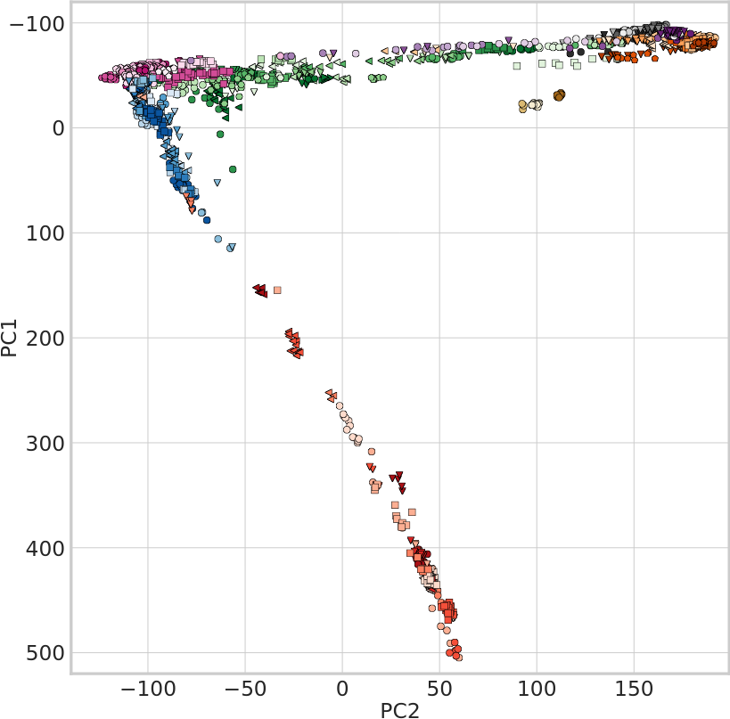

 * Hypothesis: deep learning with autoencoders can do better

 * Introduction
   * ML
   * DL
   * Dimensionality reduction
   * PCA
     * Sensitive to rare alleles
     * Sensitive to correlated SNPs due to LD 
     * Linear
   * Fix PCA by filtering or shrinkage
   * Non-ML alternatives to PCA
     * non-centred Minimum Curvilinear Embedding (ncMCE)
       * Question: why wasn't this used?
     * t-distributed stochastic neighbor embedding (t-SNE) 
     * Uniform Manifold Approximation and Projection (UMAP)
       * Problem: the focus on preserving local topology results in a projection in which distances between larger clusters are more difficult to interpret
       * Question: does GCAE solve this problem?
    * ML alternatives to PCA for SNP data
      * restricted Boltzmann machines (RBMs) [Yelmen et al., 2021]
      * variational autoencoders [Battey et al., 2020], better than t-SNE and UMAP
    * GCAE:
      * 'The main differentiating feature between GCAE and the other DL methods mentioned is that our model makes use of convolutional layers, which take into account the sequential nature of genotype data.'
 * Methods
   * Build autoencoder: 'Autoencoders are a class of DL models that transform data to a lower-dimensional latent representation from which it is subsequently reconstructed'

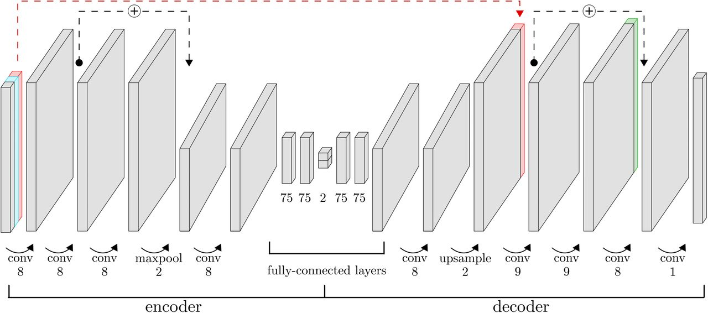

 * Methods: set up a convolutional autoencoder to learn to represent the data
   * Novelty: convolutional
   * Compare dimensionality reduction to t-SNE and UMAP
   * Compare to ADMIXTURE

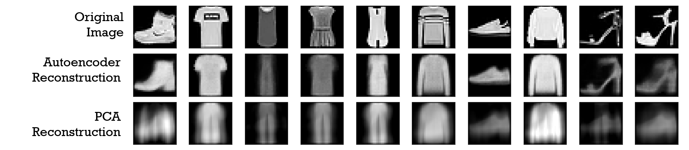

 * Discussion
   * Could use nonlinear PCA's as well:
     * Principal Curves [Hastie and Stuetzle, 1989]
     * Kernel PCA [Schölkopf et al., 1998]

## Figures

### Figure 1

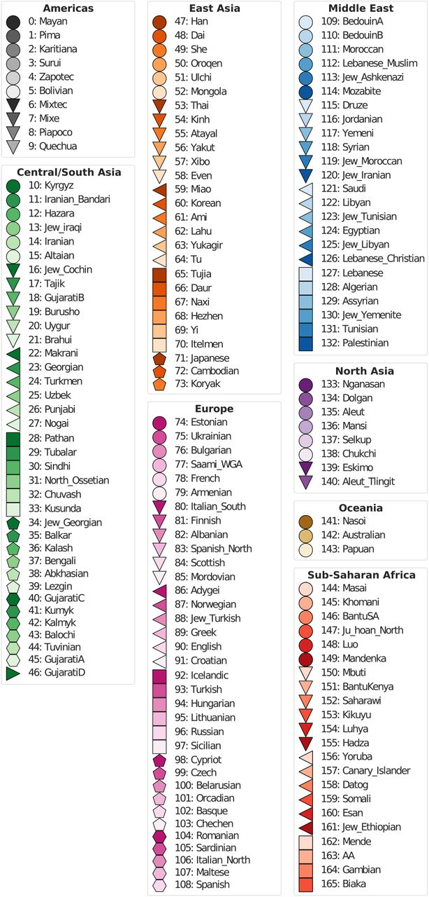

Figure 1 is just the legend for figure 3:	

### Figure 2

Figure 2 shows the architecture of the autoencoder:

 * Encoder:
 * Decoder:
 * Red bar:
 * Blue bar: A dimension representing missing and non-missing genotypes, with the values 0 and 1, respectively, is added to the input data
 * Line from red bar to decoder layer:
 * Lines from conv to maxpool layers:

### Figure 3

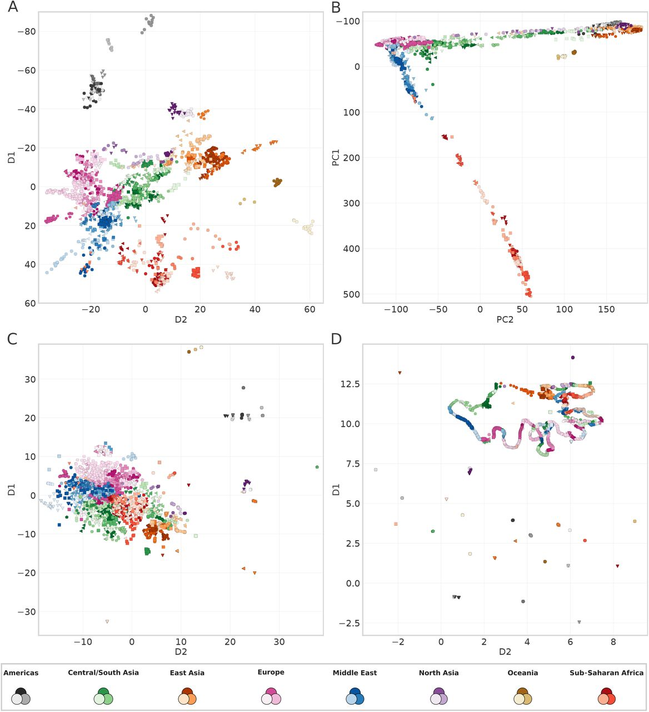

> Dimensionality reduction results for GCAE (A), PCA (B), t-SNE (C) and UMAP (D) on the Human Origins data set. For GCAE and PCA, the D1 and PC1 axes have been inverted in order to get a more direct correspondence to the cardinal geographical directions. Legend shows superpopulation colors, full legend with all populations in Figure 1.

Differentiation based on genetic information only.

 * A: GCAE: gradient: [TODO: why inverted?]
 * B: PCA: gradient: [TODO: why inverted?]
 * C: t-SNE:
 * D: UMAP:

### Figure 4

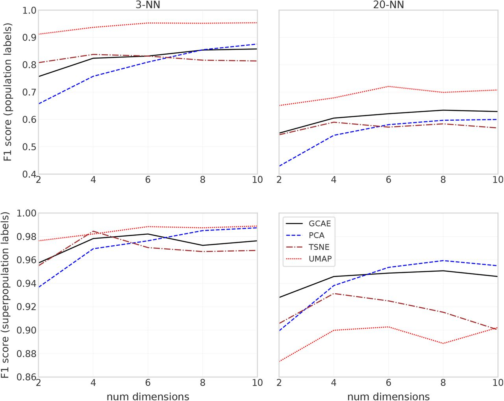

> F1 scores for 3-NN and 20-NN classification models based on dimensionality reduction of GCAE, PCA, t-SNE and UMAP using 2-10 dimensions. Top plots show results for using populations as labels in the classification, and bottom ones for using superpopulations as labels.

 * Columns: size of NN
 * Rows: score on population (top row) or superpopulation (bottom row)
 * F1 score:

### Figure 5

> Genetic clustering results with k = 5 clusters using ADMIXTURE. Each bar represents a sample from the Human Origins data set, with colors indicating the proportional assignment into k clusters for that sample. Samples are ordered by population and superpopulation, with numbering according to the legend in Figure 1.

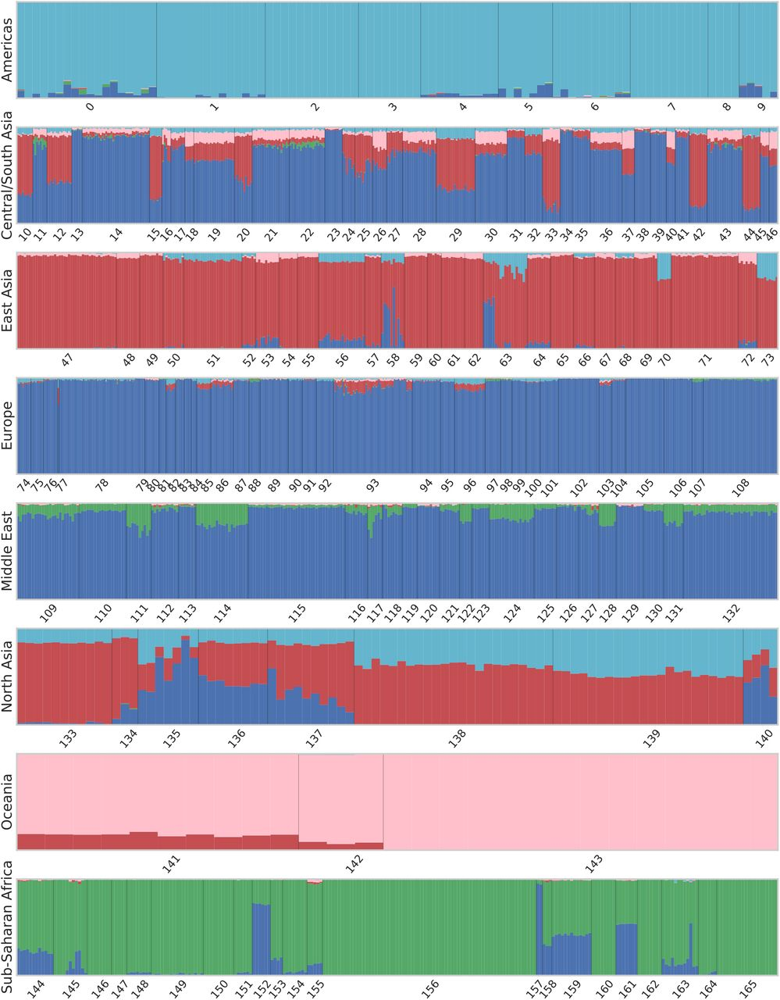

Attribibution of genotypes to superpopulation by ADMIXTURE

### Figure 6

> Genetic clustering results with k = 5 clusters using GCAE. Each bar represents a sample from the Human Origins data set, with colors indicating the proportional assignment into k clusters for that sample. Samples are ordered by population and superpopulation, with numbering according to the legend in Figure 1.

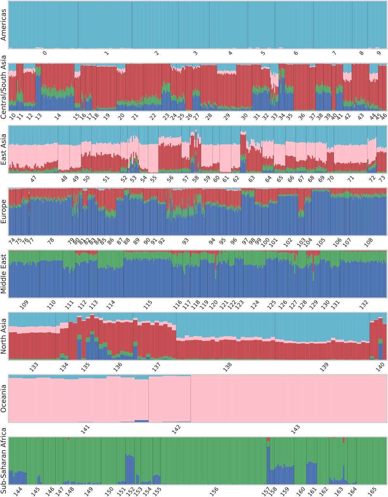

Attribibution of genotypes to superpopulation by GCAE

### Figure 7

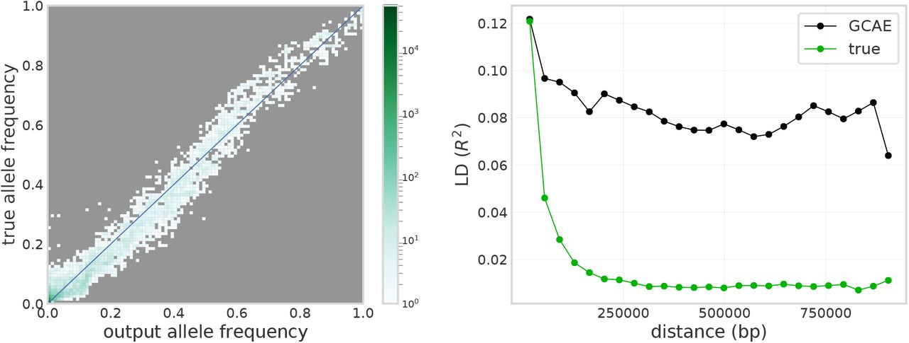

> Comparison of output from GCAE to the corresponding true genotypes for the 1000 Genomes chromosome 22 data set. 

#### Figure 7A

> Left: Site frequency spectrum of true genotypes vs. output genotypes, with color indicating number of sites in 100 allele frequency bins. 

The bottom-left corner indicates that rare alleles are 'generalized out'.

This 'may be mitigated by finer tuning of the beta parameter'.
[TODO: where is this beta parameter? It is not in the equations]

#### Figure 7B

> Right: Decay of LD with distance along the chromosome for a subset of samples and SNPs, displaying the mean value of R2 for pairs of sites in 25 distance bins.

This shows GCAE encodes LD. Unsure if it is important that these
lines match, as the NN can probably account for it in other
laters.

### Figure S3

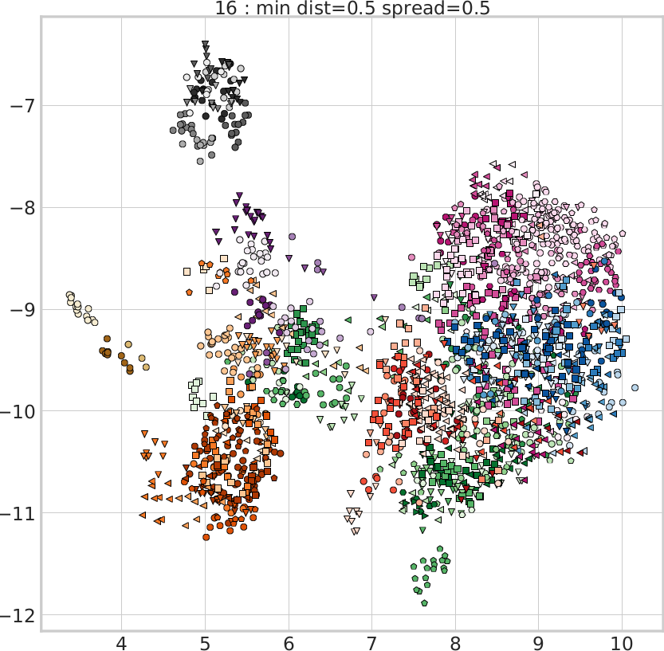

UMAP can perform reasonably well.

## Equations

### Equation 0

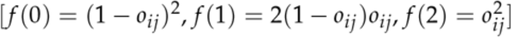

one-hot encoding: a neuron has one input per state, in this case 3

f(0) = frequency of zero markers, homozygous for major allele
f(1) = frequency of one marker, heterozygous
f(2) = frequency of two markers, homozygotous for minor allele
o_ij = model output of sample/genotype i at site j
f(0) + f(1) + f(2) = 1

Example:
o_ij = 0.2
f(0) = (1 - o_ij)^2 = (1 - 0.2)^2 = 0.8^2 = 0.64
f(1) = 2 * (1 - o_ij) * o_ij = 2 * (1 - 0.2) * 0.2 = 0.4 * 0.8 = 0.32
f(2) = o_ij ^ 2 = 0.2 ^ 2 = 0.04

### Equation 1

E: cross-entropy error
y: target genotype
`y^~`: reconstructed genotype
L2 penalty
e: latent representation

ADAM algorithm:

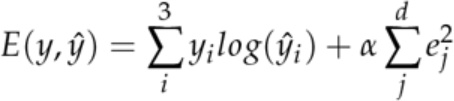

### Equation 2

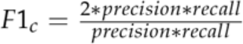

F1 score:

## Links

 * Article 'A deep learning framework for characterization of genotype data' by Kristiina Ausmees and Carl Nettelblad:
   * [bioRxiv](https://www.biorxiv.org/content/10.1101/2020.09.30.320994v2)
   * [Download main article](ausmees_and_nettelblad.pdf), from [bioRxiv](https://www.biorxiv.org/content/10.1101/2020.09.30.320994v2)
   * [Download supplementary materials](ausmees_and_nettelblad_supmat.pdf), from [bioRxiv](https://www.biorxiv.org/content/10.1101/2020.09.30.320994v2.supplementary-material)
 * [GenoCAE python package](https://github.com/richelbilderbeek/genocae/tree/Pheno)
 * [gcaer R package](https://github.com/richelbilderbeek/gcaer)

## Sources

 * [Reconstruction_autoencoders_vs_PCA.png](https://en.wikipedia.org/wiki/Autoencoder#/media/File:Reconstruction_autoencoders_vs_PCA.png)

## Refs

 * [Leznik and Tofallis, 2005] Leznik, Michael, and Chris Tofallis. "Estimating invariant principal components using diagonal regression." (2005).

 * [Hastie and Stuetzle, 1989] Hastie, Trevor, and Werner Stuetzle. "Principal curves." Journal of the American Statistical Association 84.406 (1989): 502-516.

 * [Schölkopf et al., 1998] Schölkopf, Bernhard, Alexander Smola, and Klaus-Robert Müller. "Nonlinear component analysis as a kernel eigenvalue problem." Neural computation 10.5 (1998): 1299-1319.

